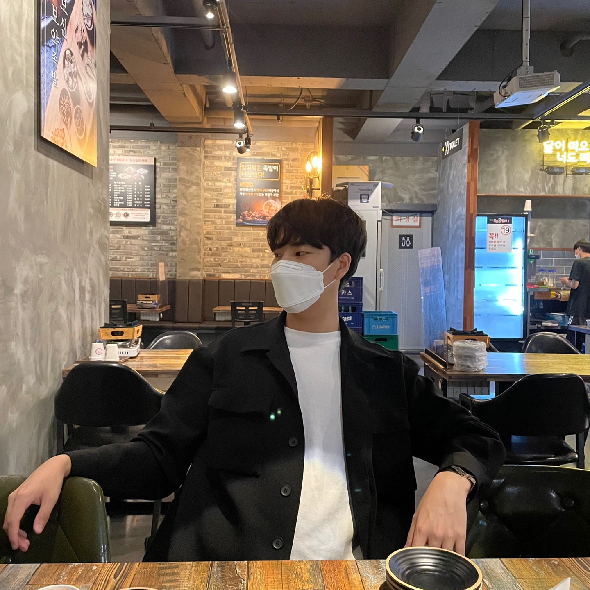

***
<div align="center">
<h3>👩‍💻introduction</h3>

_개발자가 되고 싶은 1999년생 대학생입니다 😊_
***

[](https://github.com/cchrbxo)
<h1>✨Tech Stack</h1>

 


<h1>✏️Studying</h1>


</div>


# 개발자를 꿈꾸는 대학생!  

 
 




## Introduce
* Name : 조규태
* Birth : 1999.09.03
* Address : 대구광역시 북구 복현로
* E-mail : cgt@kakao.com
* Github : cchrbxo

``` 
열정이 넘칠 나이 24살 조규태입니다.
조원과의 화합으로 최고의 결과를 만들고픈 친화성 갑 개발자가 되고 싶습니다.
항상 밝은 모습으로 팀의 활력소가 되겠습니다!
```

## Project 

#### Java

> 자바 팀프로젝트 (스마트 워치) // https://github.com/cchrbxo/2-WDA-TeamProject


#### JSP

> 팀프로젝트 // https://github.com/ooyniz/4OREVER


## Activity
* 영진전문대학교(컴퓨터 정보계열) 웹데이터베이스 전공

